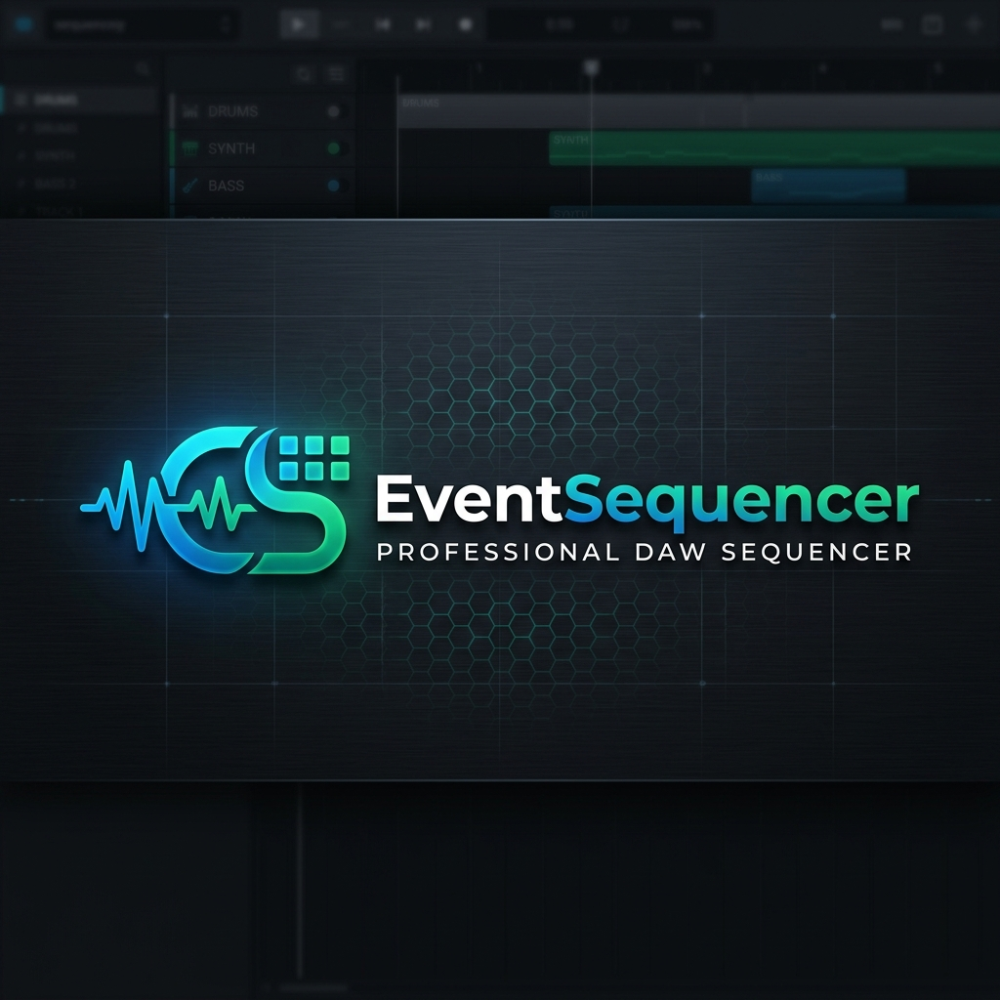
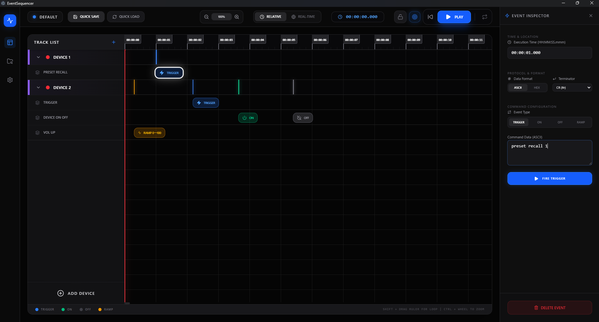

<p align="center">
  
</p>

A professional-grade standalone DAW sequencer built with Next.js and Electron (v0.9.2). Designed for mission-critical event triggering and remote hardware automation with high-precision timing.



## 📖 Manuals
- **[User Manual (English)](./docs/manual_EN.md)**
- **[操作マニュアル (日本語)](./docs/manual_JP.md)**

## ✨ Key Features

- **High-Precision Transport**: Reliable timing engine with sub-10ms resolution for accurate event triggering.
- **Smart Timeline Interface**:
  - Drag-and-drop reordering of tracks and devices.
  - Double-click to create/edit events.
  - **Auto-Width Sidebar**: Double-click the "TRACK LIST" header to auto-fit sidebar width to your content.
  - **Direct Time Entry**: Edit event execution times directly in the inspector using `HH:MM:SS.mmm` format.
- **Multi-Protocol Support**:
  - **TCP/UDP**: Send raw hex or ASCII commands with custom terminators (`CR`, `LF`, `CRLF`).
  - **OSC (Open Sound Control)**: Full support for OSC address and arguments (`int`, `float`, `double`, `string`) with real-time syntax highlighting.
- **Advanced Event Types**:
  - `Trigger`: Single discrete commands.
  - `On / Off`: State-aware command pairs.
  - `Ramp`: Automated interpolation between values (Smooth or Stepped) with real-time packet estimation. 
  - **High-Precision Engine**: Optimized for OSC faders with strict start/end value delivery and 64-bit Double support (`d:` prefix).
- **Remote TCP Control**: Integrated server on port `9001` for external automation via Stream Deck, PacketSender, or custom scripts.
- **LOCK Mode**: Safety guard for live performance environments to prevent accidental modifications.

## 🛠 Technical Stack
- **Frontend**: Next.js 15 (React 19), TailwindCSS 4, Framer Motion.
- **Runtime**: Electron 31 (Standalone Node.js environment).
- **Communication**: Integrated TCP Server for remote control.

## 🚀 Getting Started

### Build Standalone Executable (.exe)
To generate the production-ready portable Windows application:
```bash
npm run dist:exe
```
The output will be located in `dist/EventSequencer-win32-x64/`.

## 📡 Remote Control Protocol

Connect via TCP to port `9001`.

- **Supported Commands**:
  - `@play`: Start playback.
  - `@pause`: Pause playback.
  - `@stop`: Stop and reset to zero.
  - `@status`: Query current state (returns `@play@`, `@pause@`, or `@stop@`).

## 🛡 Privacy & Security

- **Zero Environment Leakage**: Codebase is strictly cleaned of absolute paths and environment-specific metadata.
- **Isolated Execution**: No external Node.js installation is required for the standalone build.
- **Secure Communication**: Internal Next.js server runs on an isolated port (`3001`) in production to avoid system conflicts.

---
Copyright © 2026. All rights reserved.
